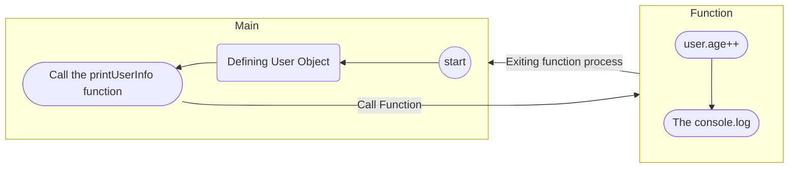

# JavaScript Struggles - Part 7 - Functions

Function in JavaScript just like most other languages **are here to write less code** and **eliminate the duplication**. When we use function it has to do something that's repeated and we wanted to isolate that piece of code.

In this article I'll be explaining how does functions work in JavaScript, and I'll explain as well the new _ES6_ arrow functions that everybody uses and tell you when is it great and when it makes nonsense to use.

Let's start!!

---

## Writing Functions In JavaScript

In JavaScript we use the keyword `function` to make a new function (yes we write the whole word function).

As I mentioned earlier in the past articles about variables we need some keyword (like `var`, `let` or `const`) to define that this is a variable and its type where `var` make it a global variable.  
While in the function when we want to create an **argument that we can use it within the function we DO NOT use any keyword**, we just add the name of the argument.

```js
function greetUser(username) {
  console.log(`Hello there, ${username}`);
}
```

---

## How Does Functions Work Behind The Scenes

Since JavaScript is an interpreted language, it has to run things step by step.  
It's also worth mentioning that JavaScript also use a garbage collector just in time of running, so the functions is read every time you use them in anywhere else again and again.

How does it work exactly?
Let's say we have this piece of code:

```js
let user = {
  firstName: "Abdelrahman",
  lastName: "Dwedar",
  age: 17,
};

function printUserInfo(user) {
  user.age++;
  console.log(
    `This user name is {user.firstName} {user.lastName}, and they are {user.age} years old.`,
  );
}

printUserInfo(user);
```



As you might understand from the graph **functions has their own process**, something else you might have to understand that **they also have their own variable declaration process**. So every variable that's defined within the function will just get defined after calling that function even if it was a global variable (using the `var` keyword).

Notice that I didn't mention the declaration of the function itself in the main process, as functions aren't as variables, variables have to be declared before using them, **while functions can be declared after calling them the interpreter will find the function declaration and run it** (Unlike what's happening is a language like C where a function has to be declared before it's called).

## What Is Arrow Functions?

We can think of arrow functions like a smaller version of functions.
It's a function that uses a new syntax that was introduced by the _ES6_.
It's mostly used for simple events that doesn't deserve its own function, and it worth mentioning that it's returning by default, so you don't need to return the value by the keyword `return`.

Also you can't use the `this` keyword within any arrow function.
Which can be a bad for some cases (thinking of the _Vue2_ example that will be mention later in this article)

Syntax:

```js
(num) => {
  return num1 < 100;
}; // You can use it like this

(num) => {
  num1 < 100;
}; // you don't need to have the return

(num) => num1 < 100; // if it's just one action there's no need for the brances
```

Example:

```js
let firstNumber = 10;
let secondNumber = 29;

function lessOrMoreThan50(num) {
  console.log(num < 50);
}

lessOrMoreThan50((firstNumber, secondNumber) =>
  Math.abs(firstNumber - secondNumber),
);
```

As you see we used the arrow function as an argument of the `lessOrMoreThan50` function (this is just an example to show the case of using the arrow function).

**It's best use case is getting some event done to be passed directly to something else like a function or even a loop.**

You can also store the arrow function in a variable like so:

```js
const numbersList = [1, 4, 5, 22, 31, 11, 23];

const oddNumbersInList = (numbersList) => {
  oddNumbersList = [];
  for (let num in numbersList) {
    if (num % 2 === 1) {
      oddNumbersList.append(num);
    }
  }

  return oddNumbersList;
};

oddNumbersInList(numbersList);
```

## Difference Between Normal & Arrow Functions

I'll start by saying that I prefer using normal functions in most cases, and I'll explain why do I like it more, and I'll also add some of the main differences between the two methods.

### The Appear Of The Function

For me and a lot of developers we find ourselves seeing the normal function as a function, while just seeing the arrow function used as a function instead makes it sound weird, it's more obvious for the eye when seeing the `function` keyword that the following is a function that can be called somewhere else.

So when I see a normal function I know it's going to be used somewhere else, unlike when I see a variable containing a arrow function, it sounds more like a variable by just seeing the `var`, `let`, `const` keywords.

```js
function buildArch1() {
	...
}

const buildArch2 = () => {
	...
}
```

Also seeing the last code example above, you can see that the arrow function is more to type compared to the normal function.  
Also if you tried to type it yourself you'll find yourself getting your fingers away of the home raw more in the arrow function.

### Where It Can Be Called

The last section might be considered as a personal preference. But this one is different, as it's a part of the placing of your code.

When we make an arrow function and store it in a variable **it's treated as a variable** mainly.

Putting the explaining of the function process and the knowledge you know generally about variables (they have to be declared before being called).

You have to declare the arrow function before it's called! You can't have the callee function after the caller function (which is the considered practice for clean code).

Let's have some code examples.

```js
// this code will work
function createNewProfile(user, username, age) {
	user.name = username;
	user.age = age;
	createId(username); // This will work
}

function createId(username) {
	...
}

// this will now work
const createNewProfile = (user, username, age) => {
	user.name = username;
	user.age = age;
	createId(username); // This will give you an error
}

const createId = (username) => {
	...
}
```

Notice that the one that didn't work is the one using the arrow function, the reason for that is that **arrow functions is treated as a variable**, so it must be declared before it's used even in other function. Unlike normal functions which get declared when it's called like it was explained in the functions process section above.

### Usage within an object

One of the most used data patterns in _ES6_ is the **object**, you can find that it was the main build block of the _Vue2_ and we was using it in different ways to get things done.

Example from the _Vue_ document:

```vue
<script>
export default {
  methods: {
    increment() {
      this.count++;
    },
  },
};
</script>
```

In the document they mentioned that **you can't use the `this` keyword in any arrow function** which made them recommend using the above syntax.

There's also another unpopular way of doing the same thing:

```vue
<script>
export default {
  methods: {
    increment: function () {
      this.count++;
    },
  },
};
</script>
```

Just seeing this makes you prefer the first one, but **both of them are the same**.

While the arrow functions will look like this (**it will NOT work**):

```vue
<script>
export default {
  methods: {
    increment: () => {
      this.count++; // This will not work as the 'this' keyword doesn't work in arrow functions
    },
  },
};
</script>
```

---

## Conclusion

I talked a bit deeper this time, as **functions isn't just some random thing, it's an important concept in programming** that has a lot to it, specially in languages like JavaScript.

If you didn't understand any part (and that's totally fine) you can contact me through Twitter and I'll try to give you simpler examples or give you some ideas to try yourself.

This articles focused on the functions area in JavaScript, **but a lot of these concepts apply to a lot of other languages**.

It's also important to note that I'm not telling anyone to just use normal functions, I like arrow functions and we need them, but only using them because other developers does is no good. **Understand then decide if you need it or not**. I suggest to **use arrow functions where it's simple action or an action that doesn't need to be separated from the rest or it'll be incomplete if it was separated**.

I hope you enjoyed the article and got something out of it, till the next time! ;)
